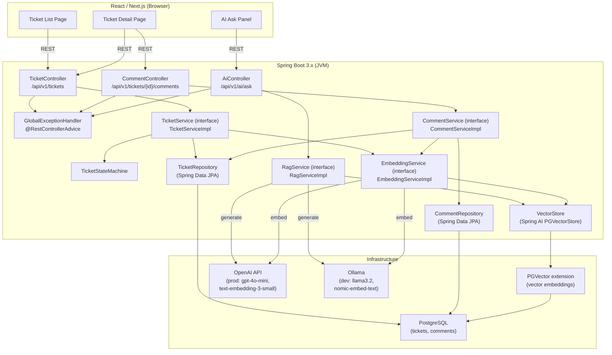
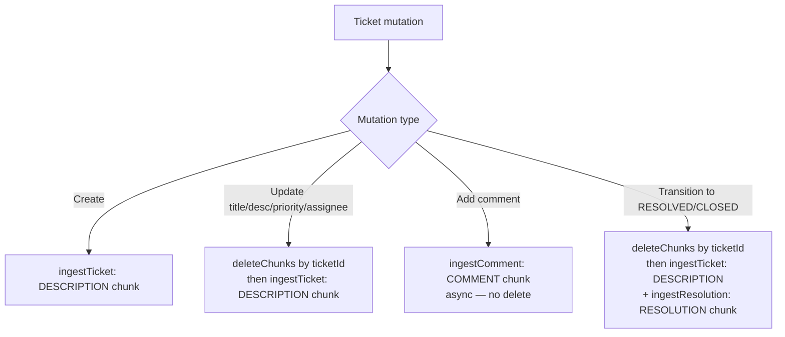

# Design Document — AI-Powered Support Ticket Management System

## Overview

The system is a full-stack application consisting of a Spring Boot 3.x backend and a React/Next.js frontend. The backend manages the full ticket lifecycle through a strictly enforced state machine, persists data in PostgreSQL, and exposes a RAG endpoint that answers natural-language questions grounded exclusively in ticket data stored as vector embeddings in PGVector. All AI behaviour (embedding, retrieval, generation) is driven by Spring AI, with OpenAI in production and Ollama in local development.

The key design goals are:
- **Correctness by enforcement**: the state machine is the single authority on valid transitions; no code path can bypass it.
- **Grounded AI only**: the RAG pipeline never falls through to general LLM knowledge; a guardrail hard-stops generation when no chunks pass the similarity threshold.
- **Separation of concerns**: strict Controller → Service → Repository layering with no entity leakage across layer boundaries.
- **Operability**: all tunable values (top-K, threshold, models) are `@ConfigurationProperties`-bound; secrets are environment-variable-only; schema is managed by Flyway.

---

## Architecture

### Component Diagram



### Request Flow — Ticket Creation

```
POST /api/v1/tickets
  → TicketController (@Valid validation)
  → TicketServiceImpl.createTicket()
      → persist Ticket entity via TicketRepository
      → publish TicketCreatedEvent (Spring ApplicationEvent)
  → EmbeddingServiceImpl (async @EventListener)
      → build prose chunk: "[title]\n\n[description]"
      → call EmbeddingModel.embed(chunk)
      → VectorStore.add(Document with metadata)
  ← return TicketResponse DTO (HTTP 201)
```

### Request Flow — RAG Ask

```
POST /api/v1/ai/ask
  → AiController (@Valid validation)
  → RagServiceImpl.ask(question)
      → EmbeddingModel.embed(question)
      → VectorStore.similaritySearch(query, topK, threshold)
      → if results.isEmpty() → return no-match response (grounded: false)
      → build system prompt with retrieved chunks
      → ChatModel.call(prompt, temperature=0.0)
      → extract ticketIds from chunk metadata
  ← return AskResponse { answer, sources, grounded: true }
```

---

## Backend Package Structure

```
com.example.kirotest/
├── config/
│   ├── AppAiProperties.java          # @ConfigurationProperties("app.ai")
│   ├── AiConfig.java                 # Spring AI beans (EmbeddingModel, ChatModel, VectorStore)
│   ├── WebConfig.java                # CORS configuration
│   └── OpenApiConfig.java            # SpringDoc customisation
├── controller/
│   ├── TicketController.java         # /api/v1/tickets, /api/v1/tickets/{id}
│   ├── CommentController.java        # /api/v1/tickets/{id}/comments
│   └── AiController.java             # /api/v1/ai/ask
├── service/
│   ├── TicketService.java            # interface
│   ├── TicketServiceImpl.java
│   ├── CommentService.java           # interface
│   ├── CommentServiceImpl.java
│   ├── EmbeddingService.java         # interface
│   ├── EmbeddingServiceImpl.java
│   ├── RagService.java               # interface
│   ├── RagServiceImpl.java
│   └── TicketStateMachine.java       # pure transition logic (no Spring deps)
├── repository/
│   ├── TicketRepository.java
│   └── CommentRepository.java
├── domain/
│   ├── Ticket.java                   # @Entity
│   ├── Comment.java                  # @Entity
│   ├── TicketStatus.java             # enum
│   └── Priority.java                 # enum
├── dto/
│   ├── request/
│   │   ├── CreateTicketRequest.java  # record
│   │   ├── UpdateTicketRequest.java  # record
│   │   ├── UpdateStatusRequest.java  # record
│   │   ├── AddCommentRequest.java    # record
│   │   └── AskRequest.java           # record
│   └── response/
│       ├── TicketResponse.java       # record
│       ├── TicketSummaryResponse.java # record (list view)
│       ├── CommentResponse.java      # record
│       ├── PagedResponse.java        # record<T>
│       └── AskResponse.java          # record
├── event/
│   ├── TicketCreatedEvent.java
│   ├── TicketUpdatedEvent.java
│   └── CommentAddedEvent.java
└── exception/
    ├── TicketNotFoundException.java
    ├── InvalidTransitionException.java
    ├── EmbeddingException.java
    ├── LlmException.java
    └── GlobalExceptionHandler.java   # @RestControllerAdvice
```

---

## Data Models

### Entity Design

### Ticket Entity

```java
@Entity
@Table(name = "tickets")
@EntityListeners(AuditingEntityListener.class)
@Data @Builder @NoArgsConstructor @AllArgsConstructor
public class Ticket {

    @Id
    @Column(name = "id", length = 20)
    private String id;                        // "TKT-1001"

    @Column(nullable = false, length = 200)
    private String title;

    @Column(nullable = false, length = 5000, columnDefinition = "TEXT")
    private String description;

    @Enumerated(EnumType.STRING)
    @Column(nullable = false, length = 20)
    private TicketStatus status;              // OPEN | IN_PROGRESS | RESOLVED | CLOSED | CANCELLED

    @Enumerated(EnumType.STRING)
    @Column(nullable = false, length = 10)
    private Priority priority;                // LOW | MEDIUM | HIGH | CRITICAL

    @Column(length = 100)
    private String assignee;

    @Column(length = 2000)
    private String resolutionNotes;

    @OneToMany(mappedBy = "ticket", cascade = CascadeType.ALL,
               orphanRemoval = true, fetch = FetchType.LAZY)
    @OrderBy("createdAt ASC")
    private List<Comment> comments = new ArrayList<>();

    @CreatedDate
    @Column(nullable = false, updatable = false)
    private Instant createdAt;

    @LastModifiedDate
    @Column(nullable = false)
    private Instant updatedAt;
}
```

### Comment Entity

```java
@Entity
@Table(name = "comments")
@EntityListeners(AuditingEntityListener.class)
@Data @Builder @NoArgsConstructor @AllArgsConstructor
public class Comment {

    @Id
    @GeneratedValue(strategy = GenerationType.UUID)
    private UUID id;

    @ManyToOne(fetch = FetchType.LAZY, optional = false)
    @JoinColumn(name = "ticket_id", nullable = false)
    private Ticket ticket;

    @Column(nullable = false, columnDefinition = "TEXT")
    private String body;

    @Column(nullable = false, length = 100)
    private String author;

    @CreatedDate
    @Column(nullable = false, updatable = false)
    private Instant createdAt;
}
```

### Enums

```java
public enum TicketStatus { OPEN, IN_PROGRESS, RESOLVED, CLOSED, CANCELLED }
public enum Priority     { LOW, MEDIUM, HIGH, CRITICAL }
```

### Ticket ID Generation

Ticket IDs use the format `TKT-{number}`. A dedicated `ticket_id_seq` PostgreSQL sequence generates the numeric part. `TicketServiceImpl` fetches the next value via a native query before persisting, constructing `"TKT-" + nextVal`.

---

## Components and Interfaces

### Repository Layer

### TicketRepository

```java
public interface TicketRepository extends JpaRepository<Ticket, String> {

    // Used for list + filter endpoint
    Page<Ticket> findByStatus(TicketStatus status, Pageable pageable);

    // Case-insensitive keyword search on title OR description
    @Query("""
        SELECT t FROM Ticket t
        WHERE LOWER(t.title) LIKE LOWER(CONCAT('%', :keyword, '%'))
           OR LOWER(t.description) LIKE LOWER(CONCAT('%', :keyword, '%'))
        """)
    Page<Ticket> searchByKeyword(@Param("keyword") String keyword, Pageable pageable);

    // Combined status + keyword filter
    @Query("""
        SELECT t FROM Ticket t
        WHERE t.status = :status
          AND (LOWER(t.title) LIKE LOWER(CONCAT('%', :keyword, '%'))
           OR  LOWER(t.description) LIKE LOWER(CONCAT('%', :keyword, '%')))
        """)
    Page<Ticket> searchByKeywordAndStatus(
        @Param("keyword") String keyword,
        @Param("status") TicketStatus status,
        Pageable pageable);

    // Next ID sequence value (native)
    @Query(value = "SELECT nextval('ticket_id_seq')", nativeQuery = true)
    Long nextIdValue();
}
```

### CommentRepository

```java
public interface CommentRepository extends JpaRepository<Comment, UUID> {
    List<Comment> findByTicketIdOrderByCreatedAtAsc(String ticketId);
}
```

**Design decision — no native SQL for search**: JPQL `LIKE` is sufficient for the keyword search requirements and keeps the codebase database-agnostic (useful for H2 in tests). Full-text search (PostgreSQL `tsvector`) is a future enhancement if performance demands it.

---

## Service Layer

### TicketService Interface

```java
public interface TicketService {
    TicketResponse createTicket(CreateTicketRequest request);
    PagedResponse<TicketSummaryResponse> listTickets(
        TicketStatus status, String search, Pageable pageable);
    TicketResponse getTicket(String id);
    TicketResponse updateTicket(String id, UpdateTicketRequest request);
    TicketResponse updateStatus(String id, UpdateStatusRequest request);
}
```

### TicketServiceImpl Responsibilities

1. **ID generation**: call `ticketRepository.nextIdValue()`, construct `"TKT-" + value`.
2. **Entity mapping**: map request DTOs → entity; map entity → response DTOs (never expose entity).
3. **State machine delegation**: delegate transition validation to `TicketStateMachine.transition()`.
4. **Event publishing**: publish `TicketCreatedEvent`, `TicketUpdatedEvent` after each mutating operation so `EmbeddingServiceImpl` can react asynchronously.
5. **Pagination**: accept `Pageable` from the controller; return `PagedResponse<T>`.

### CommentService Interface

```java
public interface CommentService {
    CommentResponse addComment(String ticketId, AddCommentRequest request);
}
```

`CommentServiceImpl` persists the comment, touches `ticket.updatedAt` (via `@LastModifiedDate` on a touch-save), then publishes `CommentAddedEvent`.

### TicketStateMachine

The state machine is a pure Java component (no Spring dependencies) — this makes it trivially testable without a Spring context.

```java
public final class TicketStateMachine {

    // Adjacency map of valid transitions
    private static final Map<TicketStatus, Set<TicketStatus>> VALID_TRANSITIONS =
        Map.of(
            TicketStatus.OPEN,        Set.of(TicketStatus.IN_PROGRESS, TicketStatus.CANCELLED),
            TicketStatus.IN_PROGRESS, Set.of(TicketStatus.RESOLVED,    TicketStatus.CANCELLED),
            TicketStatus.RESOLVED,    Set.of(TicketStatus.CLOSED),
            TicketStatus.CLOSED,      Set.of(),
            TicketStatus.CANCELLED,   Set.of()
        );

    /**
     * Validates and returns the target status.
     * Throws InvalidTransitionException if the transition is not permitted.
     */
    public TicketStatus transition(TicketStatus current, TicketStatus target) {
        if (!VALID_TRANSITIONS.getOrDefault(current, Set.of()).contains(target)) {
            throw new InvalidTransitionException(current, target);
        }
        return target;
    }
}
```

**Design decision — plain object not a Spring bean**: keeping the state machine as a plain class means it can be unit-tested with zero Spring context overhead, and the transition table is the single source of truth.

### EmbeddingService

```java
public interface EmbeddingService {
    void ingestTicket(Ticket ticket);          // DESCRIPTION chunk
    void reingestTicket(Ticket ticket);        // delete all + DESCRIPTION [+ RESOLUTION]
    void ingestComment(Comment comment);       // COMMENT chunk
    void deleteChunks(String ticketId);        // remove all chunks by metadata filter
}
```

`EmbeddingServiceImpl` is an `@Async`-capable component that listens to domain events. For `ingestTicket` and `reingestComment` it catches all exceptions, logs at `ERROR`/`WARN`, and does **not** rethrow — ensuring the ticket operation always succeeds (per Requirements 1.8, 6.4, 5.11).

Chunk text construction:
- `DESCRIPTION`: `"[ticket.title]\n\n[ticket.description]"`
- `COMMENT`: `"Comment by [author]: [body]"`
- `RESOLUTION`: `"Resolution: [ticket.resolutionNotes]"`

Metadata map passed to Spring AI `Document`:
```java
Map.of(
    "ticketId",  ticket.getId(),
    "chunkType", chunkType.name(),
    "status",    ticket.getStatus().name(),
    "priority",  ticket.getPriority().name(),
    "assignee",  Optional.ofNullable(ticket.getAssignee()).orElse(""),
    "createdAt", ticket.getCreatedAt().toString()
)
```

### RagService

```java
public interface RagService {
    AskResponse ask(AskRequest request);
}
```

`RagServiceImpl` orchestrates the single retrieval-then-generate flow:

1. Embed the question via `EmbeddingModel`.
2. Call `VectorStore.similaritySearch(SearchRequest.query(q).withTopK(topK).withSimilarityThreshold(threshold))`.
3. If results empty → return `AskResponse("No relevant tickets were found to answer this question.", List.of(), false)`.
4. Build `SystemMessage` from the grounding prompt template (filled with chunk text).
5. Call `ChatModel.call(new Prompt(List.of(systemMsg, userMsg), ChatOptionsBuilder.builder().withTemperature(0.0f).build()))`.
6. Extract `ticketId` values from `Document.getMetadata()` of retrieved chunks.
7. Return `AskResponse(answer, sources, true)`.

If the `ChatModel` call throws, propagate as `LlmException` → `GlobalExceptionHandler` → HTTP 500 with `LLM_ERROR` code.

---

## Controller Layer and REST API

### TicketController

| Method | Path | Request | Success | Notes |
|--------|------|---------|---------|-------|
| `POST` | `/api/v1/tickets` | `CreateTicketRequest` | 201 + `Location` | `@Valid` on body |
| `GET` | `/api/v1/tickets` | `?status`, `?search`, `?page`, `?size` | 200 `PagedResponse` | |
| `GET` | `/api/v1/tickets/{id}` | — | 200 `TicketResponse` | |
| `PATCH` | `/api/v1/tickets/{id}` | `UpdateTicketRequest` | 200 `TicketResponse` | |
| `PATCH` | `/api/v1/tickets/{id}/status` | `UpdateStatusRequest` | 200 `TicketResponse` | |

### CommentController

| Method | Path | Request | Success | Notes |
|--------|------|---------|---------|-------|
| `POST` | `/api/v1/tickets/{id}/comments` | `AddCommentRequest` | 201 + `Location` | |

### AiController

| Method | Path | Request | Success | Notes |
|--------|------|---------|---------|-------|
| `POST` | `/api/v1/ai/ask` | `AskRequest` | 200 `AskResponse` | |

### Request / Response DTOs (records)

```java
// ---- Requests ----
public record CreateTicketRequest(
    @NotBlank @Size(max = 200) String title,
    @NotBlank @Size(max = 5000) String description,
    @NotNull Priority priority,
    String assignee
) {}

public record UpdateTicketRequest(
    @Size(min = 1, max = 200) String title,
    @Size(min = 1, max = 5000) String description,
    Priority priority,
    String assignee
) {}  // all fields optional — null means "don't update"

public record UpdateStatusRequest(
    @NotNull TicketStatus status,
    String resolutionNotes          // optional, used when transitioning to RESOLVED
) {}

public record AddCommentRequest(
    @NotBlank String body,
    @NotBlank String author
) {}

public record AskRequest(
    @NotBlank @Size(max = 1000) String question
) {}

// ---- Responses ----
public record TicketSummaryResponse(
    String id, String title, TicketStatus status,
    Priority priority, String assignee,
    Instant createdAt, Instant updatedAt
) {}

public record TicketResponse(
    String id, String title, String description,
    TicketStatus status, Priority priority,
    String assignee, String resolutionNotes,
    Instant createdAt, Instant updatedAt,
    List<CommentResponse> comments
) {}

public record CommentResponse(UUID id, String body, String author, Instant createdAt) {}

public record PagedResponse<T>(
    List<T> data, int page, int size, long totalElements, int totalPages
) {}

public record AskResponse(String answer, List<String> sources, boolean grounded) {}
```

### Error Envelope

```java
public record ErrorResponse(
    String error,       // machine-readable code e.g. "TICKET_NOT_FOUND"
    String message,     // human-readable
    Instant timestamp,
    String path
) {}
```

### GlobalExceptionHandler Mapping

| Exception | HTTP Status | Error Code |
|-----------|------------|------------|
| `TicketNotFoundException` | 404 | `TICKET_NOT_FOUND` |
| `InvalidTransitionException` | 422 | `INVALID_TRANSITION` |
| `MethodArgumentNotValidException` | 400 | `VALIDATION_ERROR` |
| `HttpMessageNotReadableException` | 400 | `MALFORMED_JSON` |
| `LlmException` | 500 | `LLM_ERROR` |
| `Exception` (catch-all) | 500 | `INTERNAL_ERROR` |

---

## RAG Pipeline Design

### Chunking Strategy

Semantic/paragraph-based chunking preserves the natural structure of support tickets — fixed-window chunking would risk splitting mid-sentence. Each ticket produces 1–N+1 chunks:

```
Chunk 1    : "[title]\n\n[description]"           chunkType=DESCRIPTION  (always)
Chunk 2..N : "Comment by [author]: [body]"        chunkType=COMMENT      (per comment)
Chunk N+1  : "Resolution: [resolutionNotes]"      chunkType=RESOLUTION   (RESOLVED/CLOSED only)
```

### Embedding

Spring AI's `EmbeddingModel` abstraction is used directly. The concrete bean injected depends on the active profile:

| Profile | Bean | Model |
|---------|------|-------|
| `prod` | `OpenAiEmbeddingModel` | `text-embedding-3-small` (1536 dims) |
| `dev` | `OllamaEmbeddingModel` | `nomic-embed-text` (768 dims) |

**Important**: The PGVector column dimension is set per-profile via Flyway migration. Production uses 1536; dev uses 768. A mismatch causes a startup-time schema validation failure, which is intentional (fail-fast).

### Retrieval

```java
var searchRequest = SearchRequest
    .query(question)
    .withTopK(properties.retrieval().topK())
    .withSimilarityThreshold(properties.retrieval().similarityThreshold());

List<Document> chunks = vectorStore.similaritySearch(searchRequest);
```

Chunks are filtered by Spring AI's PGVector integration using cosine similarity. No additional metadata filtering is applied at the retrieval stage (all ticket chunks are candidates).

### Generation

The system prompt template is defined as a constant in `RagServiceImpl`:

```
You are a support assistant. Answer ONLY using the ticket context provided below.
Do NOT use any general knowledge outside of these tickets.
If the provided context does not contain enough information to answer the question,
respond exactly with: "No relevant tickets were found to answer this question."
Always cite the ticketId(s) you used.

Context:
{context}

Question: {question}
```

`{context}` is built by joining retrieved chunks with `\n---\n` separators, each prefixed with its `ticketId`.

### Grounding Guardrail

The guardrail is evaluated **before** calling the LLM:

```
if (chunks.isEmpty()) {
    return new AskResponse(NO_MATCH_PHRASE, List.of(), false);
}
// only reach here if chunks is non-empty
```

This ensures the LLM is never called with empty context, completely eliminating the risk of hallucinated answers when no relevant tickets exist.

### Auditability Logging

```java
log.info("RAG ask: question='{}...', retrievedChunks={}",
    question.substring(0, Math.min(200, question.length())),
    chunks.stream().map(d -> d.getMetadata().get("ticketId")).toList());
```

### Re-Ingestion Flow



All re-ingestion is triggered via Spring `ApplicationEvent` so the ticket mutation transaction can commit independently of the embedding operation.

---

## Configuration Properties Structure

```yaml
# application.yml (base — no secrets here)
spring:
  jpa:
    hibernate:
      ddl-auto: validate   # prod default; overridden to create-drop in test profile
  flyway:
    enabled: true

app:
  ai:
    embedding:
      provider: openai                         # openai | ollama
      model: text-embedding-3-small            # overridden per profile
      ollama-base-url: http://localhost:11434  # only used when provider=ollama
      dimensions: 1536                         # 768 for nomic-embed-text
    retrieval:
      top-k: 5                                 # @Min(1) @Max(100)
      similarity-threshold: 0.75              # @DecimalMin("0.0") @DecimalMax("1.0")
    generation:
      model: gpt-4o-mini                       # overridden per profile
      temperature: 0.0

# application-dev.yml
app:
  ai:
    embedding:
      provider: ollama
      model: nomic-embed-text
      dimensions: 768
    generation:
      model: llama3.2
```

### AppAiProperties (bound class)

```java
@ConfigurationProperties(prefix = "app.ai")
@Validated
public record AppAiProperties(
    @Valid Embedding embedding,
    @Valid Retrieval retrieval,
    @Valid Generation generation
) {
    public record Embedding(
        @NotBlank String provider,
        @NotBlank String model,
        String ollamaBaseUrl,
        @Min(1) int dimensions
    ) {}

    public record Retrieval(
        @Min(1) @Max(100) int topK,
        @DecimalMin("0.0") @DecimalMax("1.0") double similarityThreshold
    ) {}

    public record Generation(
        @NotBlank String model,
        @DecimalMin("0.0") @DecimalMax("2.0") double temperature
    ) {}
}
```

`@Validated` on the record causes Spring Boot to fail fast at startup if any constraint is violated — satisfying Requirement 11.6 and 15.4.

Secrets (`OPENAI_API_KEY`, `DB_PASSWORD`) are supplied **only** via environment variables referenced in `application.yml`:

```yaml
spring:
  ai:
    openai:
      api-key: ${OPENAI_API_KEY}   # not provided = startup failure
  datasource:
    password: ${DB_PASSWORD}
```

---

## Database Schema (Flyway Migrations)

### V1__create_ticket_id_sequence.sql

```sql
CREATE SEQUENCE ticket_id_seq START WITH 1001 INCREMENT BY 1;
```

### V2__create_tickets_table.sql

```sql
CREATE TABLE tickets (
    id              VARCHAR(20)     PRIMARY KEY,
    title           VARCHAR(200)    NOT NULL,
    description     TEXT            NOT NULL,
    status          VARCHAR(20)     NOT NULL,
    priority        VARCHAR(10)     NOT NULL,
    assignee        VARCHAR(100),
    resolution_notes TEXT,
    created_at      TIMESTAMPTZ     NOT NULL,
    updated_at      TIMESTAMPTZ     NOT NULL
);

CREATE INDEX idx_tickets_status    ON tickets (status);
CREATE INDEX idx_tickets_created_at ON tickets (created_at DESC);
```

### V3__create_comments_table.sql

```sql
CREATE TABLE comments (
    id          UUID            PRIMARY KEY DEFAULT gen_random_uuid(),
    ticket_id   VARCHAR(20)     NOT NULL REFERENCES tickets(id) ON DELETE CASCADE,
    body        TEXT            NOT NULL,
    author      VARCHAR(100)    NOT NULL,
    created_at  TIMESTAMPTZ     NOT NULL
);

CREATE INDEX idx_comments_ticket_id ON comments (ticket_id);
```

### V4__enable_pgvector.sql

```sql
CREATE EXTENSION IF NOT EXISTS vector;
```

### V5__create_vector_store.sql

```sql
-- Spring AI PGVectorStore creates this table automatically, but Flyway manages
-- the extension and index post-ingestion. The vector dimension is environment-specific;
-- Spring AI creates the table on first use. The HNSW index should be created after
-- initial bulk ingestion in production.

-- Post-ingestion index (run manually or via a separate migration after first load):
-- CREATE INDEX ON vector_store USING hnsw (embedding vector_cosine_ops);
```

**Design decision — Spring AI manages the vector table**: Spring AI's `PGVectorStore` creates and manages the `vector_store` table schema automatically. Flyway manages the `CREATE EXTENSION` prerequisite and documents the index creation strategy, but does not duplicate the table DDL to avoid schema drift.

---

## Frontend Component Structure

```
src/
├── app/
│   ├── page.tsx                    # redirect → /tickets
│   ├── tickets/
│   │   ├── page.tsx                # TicketListPage
│   │   └── [id]/
│   │       └── page.tsx            # TicketDetailPage
│   └── ai/
│       └── page.tsx                # AIAskPage (or panel on list page)
├── components/
│   ├── tickets/
│   │   ├── TicketTable.tsx         # table/card layout, pagination controls
│   │   ├── TicketSearchBar.tsx     # search input + status dropdown
│   │   ├── TicketDetailCard.tsx    # full ticket fields, edit inline
│   │   ├── StatusTransitionControl.tsx  # dropdown + confirm button
│   │   ├── CommentThread.tsx       # ordered comment list
│   │   └── AddCommentForm.tsx      # body + author fields
│   ├── ai/
│   │   ├── AiAskPanel.tsx          # question input + response display
│   │   └── SourceLinks.tsx         # clickable TKT-{id} chips
│   └── common/
│       ├── ErrorNotification.tsx   # displays error envelope `message`
│       ├── LoadingSpinner.tsx
│       └── Pagination.tsx
├── lib/
│   ├── api/
│   │   ├── ticketsApi.ts           # typed fetch wrappers for all ticket endpoints
│   │   ├── commentsApi.ts
│   │   └── aiApi.ts
│   └── types.ts                    # TypeScript mirrors of response DTOs
└── hooks/
    ├── useTickets.ts               # SWR/React Query hook for list
    ├── useTicket.ts                # SWR/React Query hook for detail
    └── useAsk.ts                   # mutation hook for AI ask
```

### Key Frontend Design Decisions

- **No full page reload on mutation**: status updates and comment additions use optimistic or reactive updates (SWR `mutate` / React Query `invalidateQueries`) so the UI reflects changes immediately after HTTP 200/201.
- **Error envelope forwarding**: all API calls extract the `message` field from the error envelope and pass it to `ErrorNotification`. If the API returns a non-JSON body (e.g. network failure), a generic fallback message is shown.
- **Client-side question validation**: the AI Ask panel validates `question.trim().length > 0` before sending, displaying "Question cannot be empty" inline — no redundant API call.
- **Source links**: when `grounded: true`, each entry in `sources` renders as `<Link href={/tickets/${id}}>{id}</Link>`.

---

## Correctness Properties

*A property is a characteristic or behavior that should hold true across all valid executions of a system — essentially, a formal statement about what the system should do. Properties serve as the bridge between human-readable specifications and machine-verifiable correctness guarantees.*

### Property 1: State machine rejects all invalid transitions

*For any* `(from, to)` status pair where `to` is NOT in the set of valid next states for `from`, calling `TicketStateMachine.transition(from, to)` SHALL throw `InvalidTransitionException`, and the ticket status SHALL remain unchanged.

**Validates: Requirements 5.6, 5.7**

### Property 2: State machine accepts all valid transitions

*For any* `(from, to)` status pair where `to` IS in the set of valid next states for `from`, calling `TicketStateMachine.transition(from, to)` SHALL succeed without throwing and SHALL return `to` as the new status.

**Validates: Requirements 5.1, 5.2, 5.3, 5.4, 5.5**

### Property 3: Whitespace-only inputs are always rejected

*For any* request body where a required field (title, description, question, or comment body) contains only whitespace characters (including strings of any length composed entirely of spaces, tabs, or newlines), the validation layer SHALL reject the request with HTTP 400 and the violated field name SHALL appear in the error envelope.

**Validates: Requirements 1.3, 1.4, 6.2, 10.6**

### Property 4: Keyword search is a correct filter

*For any* keyword and any set of tickets stored in the database, every ticket returned in the search result SHALL contain the keyword in its `title` OR `description` (case-insensitive), and every ticket that does contain the keyword SHALL appear in the result (no false negatives).

**Validates: Requirements 2.3, 7.1**

### Property 5: Combined status and keyword filter is conjunctive

*For any* valid status value and any keyword, the combined `?status={s}&search={kw}` query SHALL return only tickets that simultaneously match both conditions — tickets failing either condition SHALL be excluded from the result.

**Validates: Requirements 2.4, 7.4**

### Property 6: RAG no-match guardrail is deterministic

*For any* question where the vector store returns zero chunks at or above the configured `similarity-threshold`, the system SHALL return `grounded: false`, an empty `sources` array, and an `answer` that exactly equals `"No relevant tickets were found to answer this question."` — the `ChatModel` SHALL NOT be invoked.

**Validates: Requirements 10.3**

### Property 7: LLM call parameters are always grounded

*For any* question that reaches the LLM (i.e., at least one chunk exceeds the similarity threshold), the `Prompt` passed to `ChatModel.call()` SHALL contain a system message with the grounding instruction text AND the `ChatOptions` temperature SHALL equal `0.0f`.

**Validates: Requirements 10.4, 10.5**

### Property 8: Chunk metadata completeness and correctness

*For any* ticket ingested into the vector store, the stored `Document` metadata SHALL contain non-null values for `ticketId`, `chunkType`, `status`, `priority`, and `createdAt`, where `ticketId` equals the ticket's ID, `chunkType` matches the chunk's role (DESCRIPTION, COMMENT, or RESOLUTION), `status` matches the ticket's current status, and `priority` matches the ticket's priority.

**Validates: Requirements 1.7, 9.1**

### Property 9: Error envelope completeness and no stack trace leakage

*For any* exception thrown within the application and handled by `GlobalExceptionHandler`, the HTTP error response body SHALL contain non-null, non-blank values for all four fields (`error`, `message`, `timestamp`, `path`) and SHALL NOT contain any substring matching Java stack trace markers (`"at "` followed by a class name, or `"Caused by:"`).

**Validates: Requirements 8.1, 8.3, 8.4**

### Property 10: Partial update preserves unmodified fields

*For any* existing ticket and any subset of fields `{title, description, priority, assignee}` supplied in a `PATCH` payload, after the update succeeds: (a) each supplied field SHALL equal the value from the payload, (b) each field absent from the payload SHALL retain its original value, and (c) `updatedAt` SHALL be greater than or equal to its value before the update.

**Validates: Requirements 4.1, 4.5**

---

## Error Handling

### Exception Hierarchy

```
RuntimeException
├── TicketNotFoundException(String ticketId)      → HTTP 404
├── InvalidTransitionException(from, to)          → HTTP 422
├── EmbeddingException(String ticketId, Throwable cause)  → logged only; not rethrown for mutations
└── LlmException(String message, Throwable cause) → HTTP 500 LLM_ERROR
```

### Handling Matrix

| Scenario | Behaviour |
|----------|-----------|
| Ticket not found (GET/PATCH) | `TicketNotFoundException` → 404 |
| Invalid state transition | `InvalidTransitionException` → 422 with current + target status |
| Blank field in request | `MethodArgumentNotValidException` → 400 with field violations |
| Malformed JSON body | `HttpMessageNotReadableException` → 400 |
| Embedding failure at create/update | Log `ERROR`, swallow — ticket operation succeeds |
| Embedding failure at comment | Log `WARN`, swallow — comment creation succeeds |
| LLM call failure | `LlmException` → 500 with `LLM_ERROR` code |
| Any other unhandled exception | Log `ERROR`, return 500 with `INTERNAL_ERROR` — no stack trace in response |

---

## Testing Strategy

### Unit Tests (JUnit 5 + Mockito + AssertJ)

- **`TicketStateMachineTest`**: parameterised tests covering every valid and invalid transition. No Spring context — instantiate `TicketStateMachine` directly. 100% branch coverage mandatory.
- **`TicketServiceImplTest`**: mock `TicketRepository`, `TicketStateMachine`, `ApplicationEventPublisher`. Test ID generation, DTO mapping, delegation to state machine, event publication.
- **`EmbeddingServiceImplTest`**: mock `EmbeddingModel` and `VectorStore`. Verify chunk text construction, metadata map correctness, error-swallowing behaviour.
- **`RagServiceImplTest`**: mock `EmbeddingModel`, `VectorStore`, `ChatModel`. Verify guardrail (no LLM call when chunks empty), temperature setting, source extraction.
- **`GlobalExceptionHandlerTest`**: `@WebMvcTest`-slice. Verify error envelope structure for each mapped exception type.

### Property-Based Tests (jqwik)

Per the project testing guidelines, jqwik is used for state machine and input validation properties. Each property test is configured with `@Property(tries = 100)`.

- **Properties 1 + 2** (`TicketStateMachineProperties`): generate arbitrary `(TicketStatus from, TicketStatus to)` pairs; assert that `transition()` throws `InvalidTransitionException` iff `to` is not in the valid-next set for `from`, and returns `to` when it is.
  - Tag: `Feature: support-ticket-management, Property 1+2: state machine transition correctness`

- **Property 3** (`InputValidationProperties`): generate arbitrary whitespace-only strings (spaces, tabs, newlines, combinations) for title, description, question, and comment body fields; assert HTTP 400 with the field name present in the error envelope every time.
  - Tag: `Feature: support-ticket-management, Property 3: whitespace inputs rejected`

- **Property 4** (`TicketKeywordSearchProperties`): generate a random list of ticket entities persisted to H2 and a random keyword; execute the repository search query; assert every returned ticket contains the keyword in title or description (case-insensitive) and no matching ticket is absent.
  - Tag: `Feature: support-ticket-management, Property 4: keyword search correctness`

- **Property 5** (`TicketCombinedFilterProperties`): generate random ticket sets with mixed statuses and content plus a random (status, keyword) pair; apply the combined filter; assert all results satisfy both conditions.
  - Tag: `Feature: support-ticket-management, Property 5: combined filter is conjunctive`

- **Property 6** (`RagGuardrailProperties`): generate arbitrary question strings; mock `VectorStore` to return an empty list; call `RagServiceImpl.ask()`; assert `ChatModel.call()` is never invoked and response has `grounded=false`, empty sources, exact no-match phrase.
  - Tag: `Feature: support-ticket-management, Property 6: RAG no-match guardrail`

- **Property 7** (`RagLlmParametersProperties`): generate arbitrary question strings; mock `VectorStore` to return non-empty chunks; capture the `Prompt` passed to `ChatModel.call()`; assert system message contains grounding instruction and `ChatOptions.temperature == 0.0f`.
  - Tag: `Feature: support-ticket-management, Property 7: LLM call parameters grounded`

- **Property 8** (`ChunkMetadataProperties`): generate arbitrary `Ticket` instances; call `EmbeddingServiceImpl`'s chunk-building logic; assert the resulting `Document` metadata contains correct `ticketId`, `chunkType`, `status`, `priority`, and `createdAt`.
  - Tag: `Feature: support-ticket-management, Property 8: chunk metadata completeness`

- **Property 9** (`ErrorEnvelopeProperties`): generate exceptions of each mapped type; invoke the `GlobalExceptionHandler` via `@WebMvcTest`; assert the response body contains non-blank values for all four envelope fields and does not contain `"at "` stack trace markers.
  - Tag: `Feature: support-ticket-management, Property 9: error envelope completeness`

- **Property 10** (`PartialUpdateProperties`): generate random `Ticket` instances and random non-empty subsets of updatable fields; apply the patch; assert updated fields match the payload and unmodified fields are unchanged, and `updatedAt >= original updatedAt`.
  - Tag: `Feature: support-ticket-management, Property 10: partial update preserves unmodified fields`

### Integration Tests (`@SpringBootTest` + Testcontainers)

- Use `pgvector/pgvector` Docker image via Testcontainers for full PostgreSQL + PGVector stack.
- `application-test.yml` uses H2 for unit/slice tests; Testcontainers for integration tests.
- Cover the full HTTP → Controller → Service → Repository → DB slice.
- RAG retrieval quality tests: ingest a known ticket, query semantically, assert the ticket appears in top-K.

### Slice Tests (`@WebMvcTest` + MockMvc)

- All controller endpoints covered.
- Mock service layer with `@MockBean`.
- Verify request validation, status codes, response shapes, error envelopes.

### CI

- `./gradlew test` — unit + slice tests (no Docker required)
- `./gradlew integrationTest` — Testcontainers-based integration tests (Docker required)
- State machine: 100% branch coverage enforced via JaCoCo.
